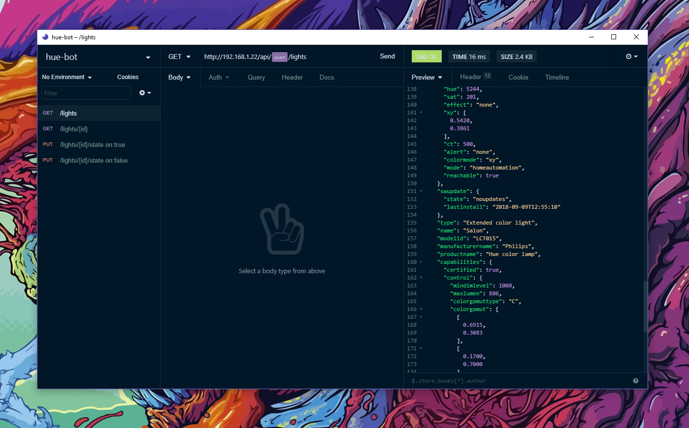

# Night Owl :owl:

An Insomnia theme for the night owls out there. Check the wonderful original
theme by @sdras for [Visual Studio Code](https://github.com/sdras/night-owl-vscode-theme).

# Installation ⏬

1. Install [Insomnia](https://insomnia.rest/)
2. Launch Insomnia
3. Go to `Preferences`
4. Got to `Plugins`
5. Write `insomnia-plugin-night-owl-theme` in the `npm-package-name` input
6. Click `Install Plugin` (if you get an error, go to [Windows](#windows)
7. Go to `Themes`
8. Select the **Night Owl** theme
9. Enjoy ! :owl:

## Windows 🏁

I have the following error on Windows platform when I try to install the plugin : 

> insomnia-plugin-night-owl-theme npm error: Command failed: %APPDATA%\insomnia\app-6.0.2\Insomnia.exe --no-deprecation %APPDATA%\insomnia\app-6.0.2\resources\bin\yarn-standalone.js info insomnia-plugin-night-owl-theme --json

To install the plugin, you can download the ZIP of the plugin, and extract the content to `%APPDATA%/insomnia/plugins`.
Then go to `Themes`, select the **Night Owl** theme and enjoy ! :owl:
